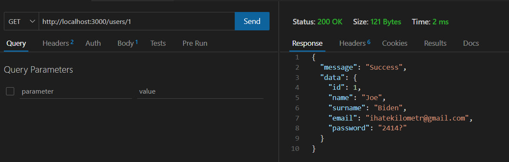

# Тестування працездатності системи

## Старт системи

    

## Створення нового користувача

    

    

## Створення користувача з некорректним набором даних

    

## Перегляд користувачів 

    

## Перегляд окремого користувача за ID 

    

## Перегляд окремого неіснуючого користувача 

    

## Зміна даних користувача

    

    

## Зміна даних користувача з уведеним полем id

    

    

## Зміна даних користувача без введених даних

    

    

## Видалення користувача 

    

    

